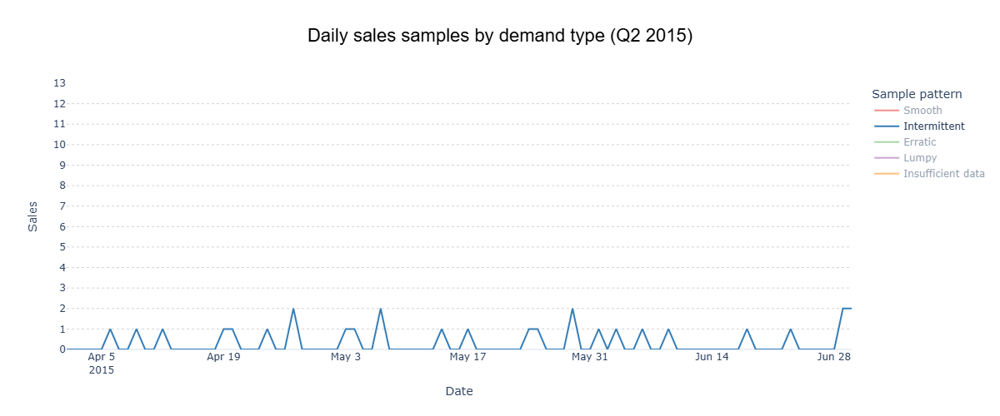
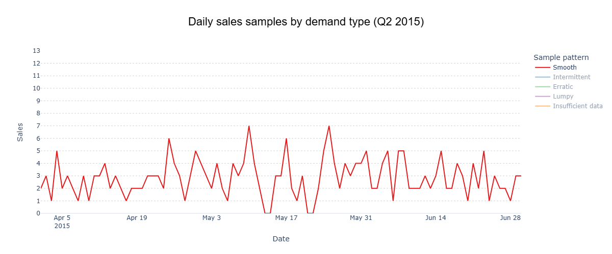
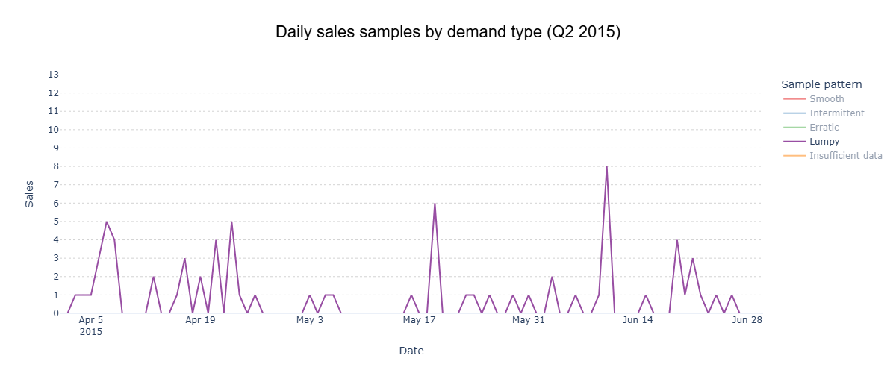
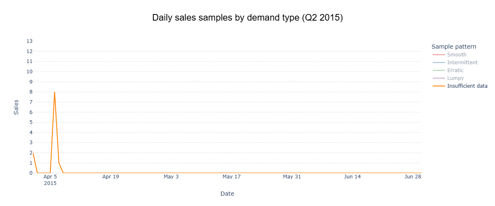

# Demand Classification: The Hidden Key to Smart Replenishment

El corazón de cualquier negocio está en su sistema de reposición. Al final del día, lo que buscamos es simple: cubrir la demanda de manera efectiva, sin quedarnos cortos, pero también sin caer en excesos que terminan convirtiéndose en stock obsoleto y liquidaciones abultadas.

El problema es que muchas empresas ponen toda su energía en encontrar ***el método*** de forecast que reduzca el error. Pasando por modelos estadísticos a técnicas de machine learning, y de ahí a sofisticados algoritmos de deep learning.

Lo que suele olvidarse es que antes de pensar en predicciones, hay que entender la demanda misma. No se puede mejorar lo que no se entiende. Por eso, clasificar la demanda es el verdadero punto de partida: estudiar su periodicidad y su variación. Solo entonces podemos ver con claridad cuáles son los desafíos de cada tipo y elegir el modelo de predicción que realmente se ajuste al negocio.

En otras palabras: antes de correr detrás del algoritmo perfecto, hay que mirar los datos de frente y etiquetar la demanda. Esa es la base sobre la que se construye un sistema de reposición realmente inteligente.

## Objetivo
En este artículo daremos ese primer paso: la clasificación de la demanda. Para hacerlo de manera concreta, trabajaremos con datos reales de la [competencia M5](https://www.kaggle.com/competitions/m5-forecasting-accuracy/data), utilizando un subconjunto del set de validación (validation). Este dataset contiene información mucho más amplia, pero para efectos de este análisis seleccionamos únicamente las ventas de distintos productos en diferentes sucursales durante el segundo semestre de 2015. El objetivo es mostrar cómo aplicar la clasificación de demanda sobre un caso acotado y realista, sin necesidad de abarcar la totalidad de los datos.

## Una mirada rápida a los datos
Tal como mencionamos, para este análisis nos enfocaremos en un subconjunto del set de validación de la competencia M5. En particular, seleccionamos el periodo correspondiente al segundo trimestre del 2015 (del 1 de abril al 30 de junio), que abarca 91 días.

En este subconjunto se incluyen 3.049 ítems distribuidos en 10 tiendas, lo que nos entrega una base sólida para observar el comportamiento real de la demanda en distintas combinaciones item-sucursal.


Cómo podemos ver, la venta diaria tiene un patron que se mueve en un promedio cercano a las 37K unidades en un intervalo desde 28K a 49K.

**Veamos que ocurre en el nivel más atomico de la demanda, es decir, a nivel item-store**


Las ventas se concentran principalmente en 1 o 2 unidades, con una marcada predominancia de la venta unitaria. Al mismo tiempo, se observan múltiples periodos con ventas iguales a cero, lo que evidencia que la demanda no se manifiesta de manera continua. Cuando se presenta, su magnitud promedio se mantiene en un rango reducido de 1 a 2 unidades.

Este patrón corresponde al fenómeno de demanda intermitente, descrito por primera vez en 1972 por John Croston en su trabajo seminal “Forecasting and Stock Control for Intermittent Demands”.

En el año 2005, Syntetos y Boylan profundizaron en el estudio de la demanda intermitente y propusieron un enfoque que dio origen a la clasificación de patrones de demanda. Esta se basa en las métricas ADI (Average Demand Interval) y CV² (Squared Coefficient of Variation), y permite distinguir cuatro categorías principales: Smooth, Intermittent, Erratic y Lumpy. Esta clasificación será la que utilizaremos en el presente análisis.

# Analisis de clasificación de demanda


```python
# Análisis de datos
import numpy as np              # Cálculo numérico y arrays
import pandas as pd             # Manejo de datos tabulares
import duckdb as ddb            # Consultas SQL en memoria o disco

# Visualización
import matplotlib.pyplot as plt # Gráficos estáticos
import matplotlib.ticker as mticker  # Formato de ejes
import matplotlib.dates as mdates    # Manejo de fechas en ejes
import seaborn as sns           # Estilos y gráficos estadísticos
import plotly.express as px     # Gráficos interactivos

# Conexión a DuckDB
con = ddb.connect()
```

Usaremos duckdb para no leer todos los datos ya que es un dataset de gran tramaño ya que fue procesado y estructurado para analisis de datos, seleccionaremos el año 2015 y el semestre 2.

```python
query = f"""
SELECT
    id,
    item_id,
    store_id,
    date,
    sales
FROM read_parquet('{SALES_DATA_PATH}')
WHERE year = 2015 AND quarter = 2
"""

sales_data = con.query(query).to_df()
```

Es un dataset con 2,774,590 millones de filas

| id                          | item_id     | store_id | date       | sales |
|-----------------------------|-------------|----------|------------|-------|
| FOODS_1_001_CA_1_validation | FOODS_1_001 | CA_1     | 2015-04-01 | 0     |
| FOODS_1_001_CA_1_validation | FOODS_1_001 | CA_1     | 2015-04-02 | 1     |
| FOODS_1_001_CA_1_validation | FOODS_1_001 | CA_1     | 2015-04-03 | 0     |
| FOODS_1_001_CA_1_validation | FOODS_1_001 | CA_1     | 2015-04-04 | 2     |
| FOODS_1_001_CA_1_validation | FOODS_1_001 | CA_1     | 2015-04-05 | 2     |

**Descripción de columnas:**

* **`id`** → Identificador único de la observación (registro).
* **`item_id`** → Identificador único del producto.
* **`store_id`** → Identificador único de la tienda.
* **`date`** → Fecha de la transacción (nivel diario).
* **`sales`** → Unidades vendidas en esa fecha, tienda y producto.

Esta consulta resume el comportamiento de ventas a nivel ítem–tienda–id, identificando la primera y última fecha con venta, la ventana total en días, el número de días efectivos de venta, además del promedio y la desviación estándar de las ventas positivas. En este caso utilizo DuckDB, ya que permite escalar este mismo tipo de operaciones a millones de registros sin perder eficiencia.

```python
query = f"""
SELECT
  id, item_id, store_id,
  MIN(CASE WHEN sales > 0 THEN date END) AS first_sale_date,
  MAX(CASE WHEN sales > 0 THEN date END) AS last_sale_date,
  DATE_DIFF('day',
    MIN(CASE WHEN sales > 0 THEN date END),
    MAX(CASE WHEN sales > 0 THEN date END)
  ) AS sales_window_days,
  SUM(CASE WHEN sales > 0 THEN 1 ELSE 0 END) AS selling_days,
  AVG(NULLIF(sales,0)) AS avg_sales,
  STDDEV_POP(NULLIF(sales,0)) AS std_sales
FROM sales_data
GROUP BY store_id, item_id, id
HAVING SUM(CASE WHEN sales > 0 THEN 1 ELSE 0 END) > 0
ORDER BY item_id, store_id
"""
```

Ahora crearemos las funciones que usaremos para procesar e identificar las metricas necesarias para nuestro analisis.

```python
def classify_demand(df):
    """
    Classify each item into a demand type following Syntetos & Boylan (2005).

    Categories:
        - Smooth       : ADI < 1.32  and CV² < 0.49
        - Intermittent : ADI ≥ 1.32 and CV² < 0.49
        - Erratic      : ADI < 1.32  and CV² ≥ 0.49
        - Lumpy        : ADI ≥ 1.32 and CV² ≥ 0.49
    """

    # Thresholds defined in the literature
    ADI_THR = 1.32
    CV2_THR = 0.49

    # Compute demand metrics
    df["ADI"] = (df["sales_window_days"] / df["selling_days"]).round(3)
    df["CV2"] = ((df["std_sales"] / df["avg_sales"]) ** 2).round(3)

    # Classification rules
    conditions = [
        (df["ADI"] < ADI_THR) & (df["CV2"] < CV2_THR),   # Smooth
        (df["ADI"] >= ADI_THR) & (df["CV2"] < CV2_THR),  # Intermittent
        (df["ADI"] < ADI_THR) & (df["CV2"] >= CV2_THR),  # Erratic
        (df["ADI"] >= ADI_THR) & (df["CV2"] >= CV2_THR)  # Lumpy
    ]
    labels = ["Smooth", "Intermittent", "Erratic", "Lumpy"]

    # Assign demand category
    df["demand_type"] = np.select(conditions, labels, default="Unknown")

    return df
```

```python    
def tag_insufficient_data(df, ratio=0.2):
    """
    Tag items as 'Insufficient data' when their sales history 
    is too short to provide reliable classification.

    Parameters
    ----------
    df : DataFrame
        Must contain the column 'sales_window_days'.
    ratio : float, default=0.2
        Proportion of the maximum sales window used as threshold.

    Returns
    -------
    DataFrame
        Same DataFrame with updated 'demand_type'.
    """

    # Threshold: % of the maximum observed sales window
    sales_threshold = int(df['sales_window_days'].max() * ratio)
    print(f"Sales threshold (days with sales) for 'Insufficient data': {sales_threshold}")

    # Relabel demand_type for items below threshold
    df['demand_type'] = np.where(
        df['sales_window_days'] < sales_threshold,
        'Insufficient data',
        df['demand_type']
    )

    return df
```

```python
def format_demand_summary(df,
                          demand_categories=['Smooth', 'Intermittent', 'Erratic', 'Lumpy', 'Insufficient data']):
    """
    Format the demand summary DataFrame:
      - Casts columns to consistent dtypes.
      - Orders demand categories.
      - Rounds numeric values for readability.

    Parameters
    ----------
    df : DataFrame
        Input DataFrame with demand summary metrics.
    demand_categories : list
        Ordered list of demand categories (e.g., 
        ["Smooth", "Intermittent", "Erratic", "Lumpy", "Insufficient data"]).

    Returns
    -------
    DataFrame
        Formatted DataFrame with standardized types and categories.
    """

    # Target dtypes for each column
    dtypes_dict = {
        "id": "category",
        "first_sale_date": "datetime64[ns]",
        "last_sale_date": "datetime64[ns]",
        "sales_window_days": "Int16",
        "selling_days": "Int16",
        "avg_sales": "Float32",
        "std_sales": "Float32",
        "ADI": "Float32",
        "CV2": "Float32",
    }

    # Ensure demand_type follows a fixed, ordered categorization
    df["demand_type"] = pd.Categorical(
        df["demand_type"],
        categories=demand_categories,
        ordered=True
    )

    # Apply data types and round numeric columns
    df = df.astype(dtypes_dict).round(3)

    return df
```

Usamos todas las funciones definidas para leer y procesar nuestros datos 

```python
demand_summary = con.query(query).to_df()

demand_summary = classify_demand(demand_summary)

demand_summary = tag_insufficient_data(demand_summary)

demand_summary = format_demand_summary(demand_summary)
```


Veamos el item que estabamos viendo:


```python
query = """
SELECT * 
FROM demand_summary
WHERE id = 'HOBBIES_1_366_CA_1_validation'
"""

demand_example_item = con.query(query).to_df()
```

| id                          | item_id       | store_id | first_sale_date | last_sale_date | sales_window_days | selling_days | avg_sales | std_sales |  ADI  |  CV2  | demand_type  |
|-----------------------------|---------------|----------|-----------------|----------------|-------------------|--------------|-----------|-----------|-------|-------|--------------|
| HOBBIES_1_366_CA_1_validation | HOBBIES_1_366 | CA_1     | 2015-04-06      | 2015-06-30     | 85                | 23           | 1.217     | 0.412     | 3.696 | 0.115 | Intermittent |


```python
# Define representative examples for each demand type
intermittent_item = 'HOBBIES_1_366_CA_1_validation'
smooth_item       = 'HOBBIES_1_275_TX_2_validation'
erratic_item      = 'HOUSEHOLD_1_177_WI_3_validation'
lumpy_item        = 'FOODS_1_143_CA_1_validation'
insdata_item      = 'FOODS_1_138_CA_4_validation'

items = [intermittent_item, smooth_item, erratic_item, lumpy_item, insdata_item]

# DuckDB query: extract only the selected items and their metrics
query = """
SELECT
    demand_type, item_id, store_id,
    ADI, CV2,
    first_sale_date, last_sale_date,
    sales_window_days, selling_days,
    avg_sales, std_sales
FROM demand_summary
WHERE id IN $items
ORDER BY demand_type
"""

# Execute query and return result as a Pandas DataFrame
sample_df = con.execute(query, {"items": items}).df()
```

| demand_type       | item_id        | store_id | first_sale_date | last_sale_date | sales_window_days | selling_days |  ADI | avg_sales | std_sales | CV2  |
|-------------------|----------------|----------|-----------------|----------------|-------------------|--------------|------|-----------|-----------|------|
| Smooth            | HOBBIES_1_275  | TX_2     | 2015-04-01      | 2015-06-30     | 90                | 87           | 1.03 | 2.98      | 1.40      | 0.22 |
| Intermittent      | HOBBIES_1_366  | CA_1     | 2015-04-06      | 2015-06-30     | 85                | 23           | 3.70 | 1.22      | 0.41      | 0.12 |
| Erratic           | HOUSEHOLD_1_177| WI_3     | 2015-04-01      | 2015-06-30     | 90                | 85           | 1.06 | 2.80      | 2.10      | 0.56 |
| Lumpy             | FOODS_1_143    | CA_1     | 2015-04-03      | 2015-06-26     | 84                | 35           | 2.40 | 2.09      | 1.75      | 0.70 |
| Insufficient data | FOODS_1_138    | CA_4     | 2015-04-01      | 2015-04-07     | 6                 | 3            | 2.00 | 3.67      | 3.09      | 0.71 |


Tal como vimos al inicio de este artículo, ahora contamos con las estadísticas necesarias para comprender mejor el comportamiento de la demanda de este producto en la sucursal. Los resultados muestran que se trata de un artículo con un patrón de venta intermitente, ya que en promedio registra ventas cada 3,7 días y, cuando lo hace, alcanza alrededor de 1,22 unidades, con una variación muy baja.

# Demand Patterns (examples)

---

### Intermittent
| demand_type  | item_id       | store_id | first_sale_date | last_sale_date | sales_window_days | selling_days |  ADI | avg_sales | std_sales | CV2  |
|--------------|---------------|----------|-----------------|----------------|-------------------|--------------|------|-----------|-----------|------|
| Intermittent | HOBBIES_1_366 | CA_1     | 2015-04-06      | 2015-06-30     | 85                | 23           | 3.70 | 1.22      | 0.41      | 0.12 |



---

### Smooth
| demand_type | item_id      | store_id | first_sale_date | last_sale_date | sales_window_days | selling_days |  ADI | avg_sales | std_sales | CV2  |
|-------------|--------------|----------|-----------------|----------------|-------------------|--------------|------|-----------|-----------|------|
| Smooth      | HOBBIES_1_275| TX_2     | 2015-04-01      | 2015-06-30     | 90                | 87           | 1.03 | 2.98      | 1.40      | 0.22 |



---

### Lumpy
| demand_type | item_id     | store_id | first_sale_date | last_sale_date | sales_window_days | selling_days |  ADI | avg_sales | std_sales | CV2  |
|-------------|-------------|----------|-----------------|----------------|-------------------|--------------|------|-----------|-----------|------|
| Lumpy       | FOODS_1_143 | CA_1     | 2015-04-03      | 2015-06-26     | 84                | 35           | 2.40 | 2.09      | 1.75      | 0.70 |



---

### Erratic
| demand_type | item_id        | store_id | first_sale_date | last_sale_date | sales_window_days | selling_days |  ADI | avg_sales | std_sales | CV2  |
|-------------|----------------|----------|-----------------|----------------|-------------------|--------------|------|-----------|-----------|------|
| Erratic     | HOUSEHOLD_1_177| WI_3     | 2015-04-01      | 2015-06-30     | 90                | 85           | 1.06 | 2.80      | 2.10      | 0.56 |


---

### Insufficient data
| demand_type       | item_id     | store_id | first_sale_date | last_sale_date | sales_window_days | selling_days |  ADI | avg_sales | std_sales | CV2  |
|-------------------|-------------|----------|-----------------|----------------|-------------------|--------------|------|-----------|-----------|------|
| Insufficient data | FOODS_1_138 | CA_4     | 2015-04-01      | 2015-04-07     | 6                 | 3            | 2.00 | 3.67      | 3.09      | 0.71 |




---

# General Statistics

### Distribution of demand patterns


### Average sales window (days)


### Average demand interval (ADI)


### Average sales per occurrence


Como conclusión final, podemos señalar que el 71% del portafolio de interacciones ítem–tienda presenta un comportamiento intermitente, con un promedio de 1,6 unidades vendidas cada 4 días durante el período analizado del segundo semestre de 2015.

Haber caracterizado el portafolio nos entrega una base sólida: sabemos cómo se comporta la demanda. El siguiente desafío es anticiparla. Pero, al igual que en este análisis, antes de aplicar cualquier modelo de predicción —ya sea estadístico, de machine learning o deep learning— es fundamental entender qué métricas utilizaremos y cuáles son sus limitaciones. Solo así podremos evaluar si un modelo realmente responde a las necesidades del negocio, más allá de su precisión matemática.


