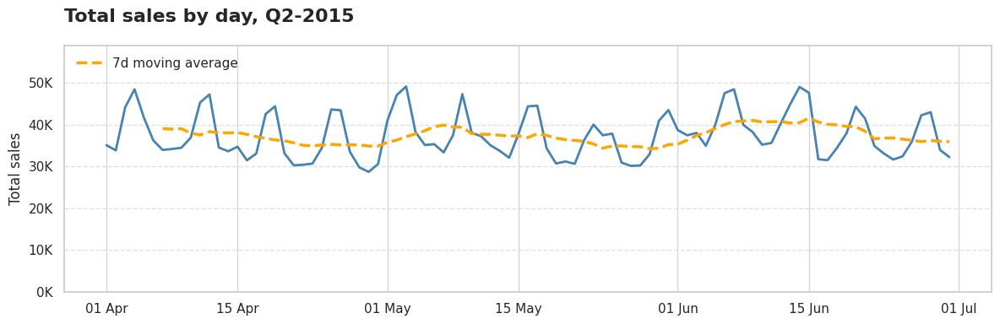

# Demand Classification: The Hidden Key to Smart Replenishment

**Author:** Nicolás Jiménez Díaz

  
<p align="center"><em>Image generated with AI</em></p>

Uno de los principales desafíos que enfrentan actualmente los negocios de ventas minoristas es la posibilidad de anticipar el volumen de unidades que se espera vender de cada ítem en cada tienda. Esto se debe a que, en la práctica, la unidad mínima de transacción en el mundo real es el ítem individual, no una categoría agregada de productos. Cada ítem puede presentar un comportamiento completamente distinto según la ubicación de la tienda, ya que cada una responde a realidades contextuales muy diferentes. En muchos casos, se observa una alta cantidad de periodos sin venta, y cuando esta ocurre, suele limitarse a entre 1 y 2 unidades, como veremos más adelante en este artículo.

Si bien es posible trabajar con datos agregados para facilitar el análisis y organización de la información, inevitablemente se debe descender hasta este nivel tan atómico de las transacciones, de una forma u otra.

El problema principal radica en que, a este nivel de transacción, los patrones de comportamiento difieren significativamente de los observables en datos agregados, donde es más sencillo identificar tendencias. Al descender al nivel más atómico de la venta, el panorama se vuelve caótico; en una primera impresión, parece gobernado por el azar. De hecho, en la competencia M5 se evidencia que este es el nivel en el que se presenta el mayor margen de error al intentar predecir el comportamiento de ventas, particularmente en series de demanda intermitente y ruidosa, tal como lo detallan Makridakis, Spiliotis y Assimakopoulos (2022) en su análisis de los resultados de la competencia.


<p align="center"><em>Tabla reproducida de “M5 Accuracy competition: Results, findings, and conclusions”, Spyros Makridakis, Evangelos Spiliotis, Vassilios Assimakopoulos, International Journal of Forecasting, 2022. Licencia CC BY‑NC‑ND 4.0.
</em></p>
En el siguiente artículo, nos adentraremos en la comprensión y estructuración de este caos. A lo largo de los años, diversos investigadores han explorado este fenómeno, proporcionándonos indicadores sumamente útiles y métricas claras para clasificar los distintos tipos de comportamiento. Esto nos permitirá entender los desafíos asociados a cada categoría y analizar cómo se comportan nuestras transacciones a nivel atómico.

---

## Resumen

En este análisis no trabajaremos con datos sintéticos, sino con información del mundo real. Utilizaremos el conjunto de datos de la [M5 forecasting competition](https://www.kaggle.com/competitions/m5-forecasting-accuracy/data), enfocándonos específicamente en el comportamiento de ventas durante el segundo semestre de 2015. Este periodo incluye 91 días de registro, con 3.049 productos distribuidos en 10 tiendas.

Estudiaremos, según lo planteado por Croston (1972), tanto la ocurrencia de la demanda como el volumen cuando esta se presenta. Los resultados de nuestro subconjunto son contundentes: el 71 % de las demandas se manifiestan de forma altamente intermitente en comparación con los datos agregados, registrando ventas de entre 1 y 2 unidades cada cuatro días. Esto no responde al ruido ni al azar, sino que representa un patrón dominante en la industria, tal como también se observa en análisis recientes sobre la competencia M5 o datos de industrias especificas.

Antes de aplicar modelos, necesitamos clasificar y entender el comportamiento de nuestra demanda en el mundo real. Muchos equipos se apresuran a utilizar algortimos avanzados de pronóstico, pero el primer paso es comprender el patrón de la demanda. Indicadores como el ADI y el CV² nos ofrecen una herramienta simple pero poderosa para lograrlo, tal como se expone en el esquema de categorización propuesto por Syntetos, Boylan & Croston (2005) y posteriormente refinado por Kostenko & Hyndman (2006).

---

## ¿Por qué la intermitencia de la demanda importa?

Muchos negocios concentran sus esfuerzos en encontrar el algoritmo de predicción ideal, aquel que permita reducir al mínimo los errores de pronóstico. En esta búsqueda, se recurre desde modelos estadísticos tradicionales hasta enfoques más sofisticados como el machine learning y el deep learning, tal como lo demuestran Kiefer, Grimm, Bauer y van Dinther (2020) en su estudio comparativo sobre métodos aplicados a demandas intermitentes e irregulares.

Sin embargo, no es posible predecir lo que aún no se comprende. Antes de aspirar a un modelo perfecto, es fundamental entender en profundidad los patrones de comportamiento de la demanda y aceptar la naturaleza que estos presentan. Solo así será posible adaptarse de forma efectiva y reducir los altos niveles de error, los cuales, en el entorno real, se traducen en costos de inventario, liquidaciones forzadas y, lo más crítico, ventas perdidas.


<p align="center"><em>Image generated with AI</em></p>

En este contexto, los sistemas y métodos de asignación de mercadería en el punto de venta se consolidan como el núcleo operativo de cualquier negocio. Su objetivo es claro: satisfacer la demanda de manera eficiente, evitando tanto los quiebres de stock como la acumulación de inventario, que puede derivar en obsolescencia y pérdidas económicas por liquidaciones.

---

## Data y alcance del analisis

Para comprender este tema de manera práctica, estudiaremos datos reales provenientes de la [competencia M5 Forecasting](https://www.kaggle.com/competitions/m5-forecasting-accuracy/data). Específicamente, utilizaremos un subconjunto correspondiente al segundo trimestre de 2015 (Q2 2015), que abarca del 1 de abril al 30 de junio, para un total de 91 días.

Nuestro conjunto de datos incluye 3.049 productos distribuidos en 10 sucursales, lo que representa aproximadamente 2,8 millones de registros de comportamiento de demanda.

Como se observa en el siguiente gráfico, las ventas agregadas totales se sitúan en torno a las 37.000 unidades diarias, con un rango que varía entre 28.000 y 49.000 unidades. Se identifican picos marcados que contrastan claramente con los valles en los niveles de venta.



Al observar la demanda a un nivel más atómico, se evidencia que las ventas se concentran principalmente en 1 o 2 unidades, con una clara predominancia de ventas de una sola unidad. Se identifican múltiples periodos con ventas nulas, lo que demuestra que la demanda no se manifiesta de forma continua. Cuando se presenta, su magnitud promedio se mantiene dentro de un rango reducido.


Este patrón corresponde a una demanda intermitente, descrita por primera vez por John Croston en su obra seminal de 1972, "Forecasting and Stock Control for Intermittent Demands."

---
## Metodologia

### a) Resumen de estadisticas de ventas a nivel item-store

**Nota técnica:** Para el análisis a gran escala, utilizamos DuckDB, lo que nos permitió consultar eficientemente un conjunto de datos con millones de registros sin necesidad de cargarlo completamente en memoria. Este enfoque permite escalar de manera fluida al procesar datos de años completos que abarcan miles de productos y tiendas.

```python
import pandas as pd
import duckdb as ddb

con = ddb.connect()

query = """
SELECT
  id, item_id, store_id,
  MIN(CASE WHEN sales > 0 THEN date END) AS first_sale_date,
  MAX(CASE WHEN sales > 0 THEN date END) AS last_sale_date,
  DATE_DIFF('day',
    MIN(CASE WHEN sales > 0 THEN date END),
    MAX(CASE WHEN sales > 0 THEN date END)
  ) AS sales_window_days,
  SUM(CASE WHEN sales > 0 THEN 1 ELSE 0 END) AS selling_days,
  AVG(NULLIF(sales,0)) AS avg_sales,
  STDDEV_POP(NULLIF(sales,0)) AS std_sales
FROM read_parquet('{SALES_DATA_PATH}')
WHERE year = 2015 AND quarter = 2
GROUP BY store_id, item_id, id
HAVING SUM(CASE WHEN sales > 0 THEN 1 ELSE 0 END) > 0
"""

demand_summary = con.query(query).to_df()
```

|   | id                           | item_id    | store_id | first_sale_date | last_sale_date | sales_window_days | selling_days | avg_sales | std_sales |
|---|------------------------------|------------|----------|-----------------|----------------|-------------------|--------------|-----------|-----------|
| 0 | FOODS_1_001_CA_1_validation  | FOODS_1_001 | CA_1    | 2015-04-02      | 2015-06-27     | 86                | 35           | 1.600     | 0.868     |
| 1 | FOODS_1_001_CA_2_validation  | FOODS_1_001 | CA_2    | 2015-04-02      | 2015-06-29     | 88                | 31           | 2.194     | 1.874     |
| 2 | FOODS_1_001_CA_3_validation  | FOODS_1_001 | CA_3    | 2015-04-04      | 2015-06-30     | 87                | 28           | 2.464     | 3.300     |
| 3 | FOODS_1_001_CA_4_validation  | FOODS_1_001 | CA_4    | 2015-04-08      | 2015-06-26     | 79                | 21           | 1.238     | 0.426     |
| 4 | FOODS_1_001_TX_1_validation  | FOODS_1_001 | TX_1    | 2015-04-04      | 2015-06-30     | 87                | 28           | 1.321     | 0.710     |
| 5 | FOODS_1_001_TX_2_validation  | FOODS_1_001 | TX_2    | 2015-04-02      | 2015-06-15     | 74                | 27           | 1.370     | 0.554     |
| 6 | FOODS_1_001_TX_3_validation  | FOODS_1_001 | TX_3    | 2015-04-01      | 2015-06-27     | 87                | 26           | 2.000     | 1.359     |
| 7 | FOODS_1_001_WI_1_validation  | FOODS_1_001 | WI_1    | 2015-04-04      | 2015-06-28     | 85                | 26           | 1.192     | 0.482     |
| 8 | FOODS_1_001_WI_2_validation  | FOODS_1_001 | WI_2    | 2015-04-01      | 2015-06-30     | 90                | 29           | 1.241     | 0.677     |
| 9 | FOODS_1_001_WI_3_validation  | FOODS_1_001 | WI_3    | 2015-04-02      | 2015-06-24     | 83                | 12           | 1.167     | 0.553     |

---
### b) Proceso de clasificacion

#### Metricas para clasificar demanda

#####  1) ADI (Average Demand Interval)

**Fórmula original (literatura):**

\[
ADI = \frac{\text{Number of Periods}}{\text{Number of Periods with Demand}}
\]


**Fórmula en nuestro análisis (adaptación operativa):**

\[
ADI = \frac{\text{sales\_window\_days}}{\text{selling\_days}}
\]

***Donde:***
  - **sales_window_days**: días transcurridos entre la primera y la última venta registrada.  
  - **selling_days**: número de días con ventas mayores a cero.  

**Interpretación:** mide el intervalo promedio (en días) entre ocurrencias de ventas positivas.

  - ***ADI bajo*** → demanda frecuente (más cercana a continua).  
  - **ADI alto** → demanda dispersa (más intermitente).  

**Implementación en código:**

```python
demand_summary["ADI"] = (
    demand_summary["sales_window_days"] / demand_summary["selling_days"]
)
```

---

##### 2) CV² (Coeficiente de variación al cuadrado)

\[
CV^2 = \left(\frac{\sigma}{\mu}\right)^2
\]

***Donde:***

  - $\sigma$ = desviación estándar de las cantidades vendidas (*solo considerando ventas > 0*).  
  - $\mu$ = media de las cantidades vendidas (*solo considerando ventas > 0*).  

**Interpretación:** CV² captura la *volatilidad de las cantidades vendidas* cuando ocurre la demanda.  

- ***CV² bajo*** → unidades de venta estables.  
- ***CV² alto*** → unidades de venta altamente variables.  

**Implementación en código:**

```python
demand_summary["CV2"] = (
    (demand_summary["std_sales"] / demand_summary["avg_sales"]) ** 2
)
```

---

#### Reglas de Clasificación (Syntetos & Boylan, 2005)

- **Suave (Smooth)**: ADI < 1.32 y CV² < 0.49 (frecuente, estable)  
- **Intermitente (Intermittent)**: ADI ≥ 1.32 y CV² < 0.49 (esporádica, estable)  
- **Errática (Erratic)**: ADI < 1.32 y CV² ≥ 0.49 (frecuente, volátil)  
- **Irregular / Lumpy (Lumpy)**: ADI ≥ 1.32 y CV² ≥ 0.49 (esporádica, volátil)  


**Implementación en código:**

```python
def classify_demand(df):
    """
    Classify each item into a demand type following Syntetos & Boylan (2005).

    Categories:
        - Smooth       : ADI < 1.32  and CV² < 0.49
        - Intermittent : ADI ≥ 1.32 and CV² < 0.49
        - Erratic      : ADI < 1.32  and CV² ≥ 0.49
        - Lumpy        : ADI ≥ 1.32 and CV² ≥ 0.49
    """

    # Thresholds defined in the literature
    ADI_THR = 1.32
    CV2_THR = 0.49

    # Compute demand metrics
    df["ADI"] = (df["sales_window_days"] / df["selling_days"]).round(3)
    df["CV2"] = ((df["std_sales"] / df["avg_sales"]) ** 2).round(3)

     # * Round 3 decimal for memory when we have millions time series

    # Classification rules
    conditions = [
        (df["ADI"] < ADI_THR) & (df["CV2"] < CV2_THR),   # Smooth
        (df["ADI"] >= ADI_THR) & (df["CV2"] < CV2_THR),  # Intermittent
        (df["ADI"] < ADI_THR) & (df["CV2"] >= CV2_THR),  # Erratic
        (df["ADI"] >= ADI_THR) & (df["CV2"] >= CV2_THR)  # Lumpy
    ]
    labels = ["Smooth", "Intermittent", "Erratic", "Lumpy"]

    # Assign demand category
    df["demand_type"] = np.select(conditions, labels, default="Unknown")

    return df
```

---
#### Manejo de datos insuficientes

Los ítems con ventanas de ventas **menores al 20 % de la ventana máxima observada** se etiquetan como ***"Insufficient data"***, con el fin de evitar clasificaciones poco representativas.

**Implementación en código:**

```python    
def tag_insufficient_data(df, ratio=0.2):
    """
    Tag items as 'Insufficient data' when their sales history 
    is too short to provide reliable classification.
    """

    # Threshold: % of the maximum observed sales window
    sales_threshold = int(df['sales_window_days'].max() * ratio)
    
    # Relabel demand_type for items below threshold
    df['demand_type'] = np.where(
        df['sales_window_days'] < sales_threshold,
        'Insufficient data',
        df['demand_type']
    )

    return df
```

---
## Hallazgos

### a) Estadisticas generales

**Intermittent demand dominates**: 71% of item-store combinations exhibit intermittent patterns, selling an average of 1.6 units every 4 days during the analyzed period.


The remaining portfolio distributes as follows:
- Smooth: 14%
- Lumpy: 9%
- Erratic: 3%
- Insufficient data: 3%

**Key portfolio metrics**:


### b) Visual Examples

Now let's see how these patterns look graphically. Each demand type has distinct visual characteristics that make pattern recognition intuitive once you know what to look for:

**Intermittent** (ADI=3.70, CV²=0.12): HOBBIES_1_366 at CA_1
- Sales window: 85 days, selling days: 23
- Average sales: 1.22 units, low variation (std=0.41)
- Clear gaps between sales with consistent quantities


**Smooth** (ADI=1.03, CV²=0.22): HOBBIES_1_275 at TX_2  
- Sales window: 90 days, selling days: 87
- Average sales: 2.98 units, moderate variation (std=1.40)
- Nearly continuous sales with stable quantities


**Erratic** (ADI=1.06, CV²=0.56): HOUSEHOLD_1_177 at WI_3
- Sales window: 90 days, selling days: 85  
- Average sales: 2.80 units, high variation (std=2.10)
- Frequent sales but highly variable quantities


**Lumpy** (ADI=2.40, CV²=0.70): FOODS_1_143 at CA_1
- Sales window: 84 days, selling days: 35
- Average sales: 2.09 units, high variation (std=1.75)
- Sporadic sales with unpredictable quantities


**Insufficient data** (ADI=2.00, CV²=0.71): FOODS_1_138 at CA_4
- Sales window: 6 days, selling days: 3
- Metrics unreliable due to limited history


### Key Insights

• **Intermittent patterns require specialized forecasting methods**. Traditional techniques fail when demand occurs sporadically.

• **Sales concentration in 1-2 units** suggests unit-level precision is critical for inventory decisions.

• **High proportion of zero-sales days** confirms the inadequacy of continuous demand assumptions.

• **Pattern stability within categories** validates the classification approach for model selection.

## Implications

Having characterized the portfolio gives us a solid foundation: we know how demand behaves. The next challenge is to anticipate it. But, as with this analysis, before applying any forecasting model—whether statistical, machine learning, or deep learning—it is essential to understand which metrics we will use and their limitations.

Only then can we evaluate whether a model truly responds to business needs, beyond its mathematical precision. Classification helps choose appropriate forecasting models, explains why metrics like MAPE fail for intermittent patterns, and points toward better alternatives like MAPE, RMSE, or MAE that properly handle the realities of sporadic demand.

## Next Steps

This demand classification analysis establishes the groundwork for intelligent forecasting. Future work will explore model selection strategies, performance measurement approaches, and the practical implementation of pattern-based replenishment systems that align mathematical precision with business objectives.

## References

**Croston, J. D.** (1972). Forecasting and stock control for intermittent demands. *Operational Research Quarterly*, 23(3), 289-303.

**Makridakis, S., Spiliotis, E., & Assimakopoulos, V.** (2022). *M5 Accuracy Competition: Results, Findings, and Conclusions*. *International Journal of Forecasting*.

**Syntetos, A. A., Boylan, J. E., & Croston, J. D.** (2005). On the categorization of demand patterns. Journal of the Operational Research Society, 56(5), 495–503.

**Kiefer, D., Grimm, F., Bauer, M., & van Dinther, C.** (2020). Demand Forecasting Intermittent and Lumpy Time Series: Comparing Statistical, Machine Learning and Deep Learning Methods. Proceedings of the 53rd Hawaii International Conference on System Sciences. 

Kolassa, S. (2016). Evaluating predictive count data distributions in retail sales forecasting. *International Journal of Forecasting*, 32(3), 788-803.

Makridakis, S., Spiliotis, E., & Assimakopoulos, V. (2020). The M4 competition: 100,000 time series and 61 forecasting methods. *International Journal of Forecasting*, 36(1), 54-74.

Silver, E. A., Pyke, D. F., & Peterson, R. (1998). *Inventory management and production planning and scheduling* (3rd ed.). John Wiley & Sons.

Syntetos, A. A., & Boylan, J. E. (2005). The accuracy of intermittent demand estimates. *International Journal of Forecasting*, 21(2), 303-314.