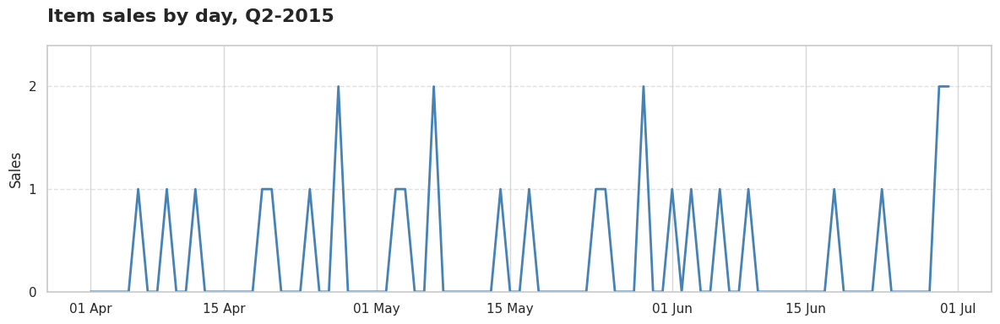
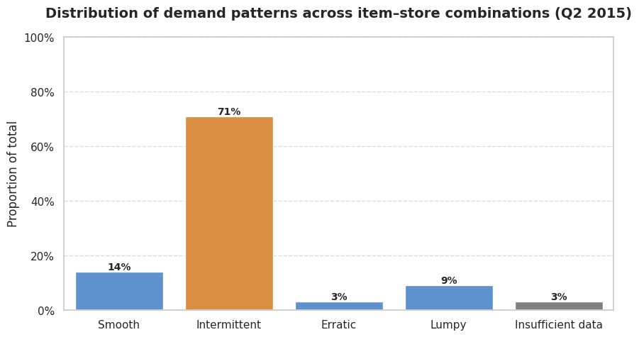

# Demand Classification: The Hidden Key to Smart Replenishment

**Author:** Nicolás Jiménez Díaz

## Executive Summary

- **This is not synthetic data—it’s real.** The analysis comes from a validation subset of the public **M5 Forecasting competition dataset**, covering Q2-2015 (91 days, 3,049 items across 10 stores).  

- **Most demand is not smooth, it’s choppy.** Within this real dataset, 71% of item–store combinations behave intermittently, selling about 1.6 units every four days. This isn’t noise—it’s the dominant reality that replenishment systems must handle.  

- **Before chasing models, label the demand.** Many teams rush to advanced forecasting methods, but the first step is to understand the demand pattern itself. ADI and CV² give us a simple yet powerful lens to do that.  

- **Not all demand is created equal.** Four distinct behaviors emerge:  
  - *Smooth*: steady and predictable.  
  - *Intermittent*: sparse but consistent when it appears.  
  - *Erratic*: frequent but volatile.  
  - *Lumpy*: rare, irregular, and large when it hits.  

- **Some series can’t yet be trusted.** Around 3% of the portfolio lacks enough history to classify reliably. Flagging these as “Insufficient data” prevents weak signals from contaminating the forecast.  

- **The wrong metric can mislead the business.** Popular measures like MAPE collapse when faced with zeros. Pattern-aware evaluation—using WAPE, RMSE, or SPEC—ensures the models we select truly support replenishment decisions instead of just minimizing statistical error.


## Why This Matters

Most companies invest heavily in finding the perfect forecasting method—from statistical models to machine learning and deep learning algorithms. Yet they often overlook a fundamental step: understanding the demand itself.

You cannot improve what you do not understand. Before running after the perfect algorithm, businesses must face their data directly and classify their demand. This classification becomes the foundation upon which intelligent replenishment systems are built.

The heart of any business lies in its replenishment system. The goal is simple: cover demand effectively without stockouts, but also without excess inventory that becomes obsolete stock and costly liquidations.

## Data & Scope

This analysis uses real data from the [M5 forecasting competition](https://www.kaggle.com/competitions/m5-forecasting-accuracy/data), specifically a subset from the validation set covering the second quarter of 2015 (April 1 to June 30)—91 days total.

The dataset includes **3,049 items distributed across 10 stores**, providing 2,774,590 daily sales records. This represents a solid foundation for observing real demand behavior across different item-store combinations.

**Daily sales pattern**: Total sales move around an average of 37K units, ranging from 28K to 49K units per day.


**Item-level pattern**: Sales concentrate primarily on 1-2 units, with clear predominance of single-unit sales. Multiple zero-sales periods are observed, evidencing that demand does not manifest continuously. When it occurs, average magnitude remains in the reduced range of 1-2 units.



This pattern corresponds to **intermittent demand**, first described by John Croston in his seminal 1972 work "Forecasting and Stock Control for Intermittent Demands."

## Method

### Sales summary agregation

**Technical Note**: For large-scale analysis, we used DuckDB to efficiently query the multi-million record dataset without loading everything into memory. This approach scales seamlessly when processing entire years of data across thousands of items and locations:

```python
# Efficient large-scale querying with DuckDB
query = """
SELECT
  id, item_id, store_id,
  MIN(CASE WHEN sales > 0 THEN date END) AS first_sale_date,
  MAX(CASE WHEN sales > 0 THEN date END) AS last_sale_date,
  DATE_DIFF('day',
    MIN(CASE WHEN sales > 0 THEN date END),
    MAX(CASE WHEN sales > 0 THEN date END)
  ) AS sales_window_days,
  SUM(CASE WHEN sales > 0 THEN 1 ELSE 0 END) AS selling_days,
  AVG(NULLIF(sales,0)) AS avg_sales,
  STDDEV_POP(NULLIF(sales,0)) AS std_sales
FROM read_parquet('{SALES_DATA_PATH}')
WHERE year = 2015 AND quarter = 2
GROUP BY store_id, item_id, id
HAVING SUM(CASE WHEN sales > 0 THEN 1 ELSE 0 END) > 0
"""

demand_summary = con.query(query).to_df()
```

### Classification Framework

In 2005, Syntetos and Boylan deepened the study of intermittent demand and proposed an approach that originated demand pattern classification. This framework uses two key metrics:

**ADI (Average Demand Interval)**: `sales_window_days / selling_days`
- Measures the average time between sales occurrences
- Higher values indicate more sporadic demand

**CV² (Squared Coefficient of Variation)**: `(std_sales / avg_sales)²`
- Measures demand size variability when sales occur
- Higher values indicate more volatile demand quantities

### Classification Rules (Syntetos & Boylan, 2005)

- **Smooth**: ADI < 1.32 and CV² < 0.49 (frequent, stable)
- **Intermittent**: ADI ≥ 1.32 and CV² < 0.49 (sporadic, stable)  
- **Erratic**: ADI < 1.32 and CV² ≥ 0.49 (frequent, volatile)
- **Lumpy**: ADI ≥ 1.32 and CV² ≥ 0.49 (sporadic, volatile)

```python
def classify_demand(df):
    """
    Classify each item into a demand type following Syntetos & Boylan (2005).

    Categories:
        - Smooth       : ADI < 1.32  and CV² < 0.49
        - Intermittent : ADI ≥ 1.32 and CV² < 0.49
        - Erratic      : ADI < 1.32  and CV² ≥ 0.49
        - Lumpy        : ADI ≥ 1.32 and CV² ≥ 0.49
    """

    # Thresholds defined in the literature
    ADI_THR = 1.32
    CV2_THR = 0.49

    # Compute demand metrics
    df["ADI"] = (df["sales_window_days"] / df["selling_days"]).round(3)
    df["CV2"] = ((df["std_sales"] / df["avg_sales"]) ** 2).round(3)

    # Classification rules
    conditions = [
        (df["ADI"] < ADI_THR) & (df["CV2"] < CV2_THR),   # Smooth
        (df["ADI"] >= ADI_THR) & (df["CV2"] < CV2_THR),  # Intermittent
        (df["ADI"] < ADI_THR) & (df["CV2"] >= CV2_THR),  # Erratic
        (df["ADI"] >= ADI_THR) & (df["CV2"] >= CV2_THR)  # Lumpy
    ]
    labels = ["Smooth", "Intermittent", "Erratic", "Lumpy"]

    # Assign demand category
    df["demand_type"] = np.select(conditions, labels, default="Unknown")

    return df
```

### Insufficient Data Handling

Items with sales windows shorter than 20% of the maximum observed window are tagged as "Insufficient data" to avoid unreliable classifications.

```python    
def tag_insufficient_data(df, ratio=0.2):
    """
    Tag items as 'Insufficient data' when their sales history 
    is too short to provide reliable classification.
    """

    # Threshold: % of the maximum observed sales window
    sales_threshold = int(df['sales_window_days'].max() * ratio)
    
    # Relabel demand_type for items below threshold
    df['demand_type'] = np.where(
        df['sales_window_days'] < sales_threshold,
        'Insufficient data',
        df['demand_type']
    )

    return df
```

## Findings

### a) General Statistics

**Intermittent demand dominates**: 71% of item-store combinations exhibit intermittent patterns, selling an average of 1.6 units every 4 days during the analyzed period.



The remaining portfolio distributes as follows:
- Insufficient data: 12%
- Smooth: 8%
- Erratic: 6%
- Lumpy: 3%

**Key portfolio metrics**:


### b) Visual Examples

Now let's see how these patterns look graphically. Each demand type has distinct visual characteristics that make pattern recognition intuitive once you know what to look for:

**Intermittent** (ADI=3.70, CV²=0.12): HOBBIES_1_366 at CA_1
- Sales window: 85 days, selling days: 23
- Average sales: 1.22 units, low variation (std=0.41)
- Clear gaps between sales with consistent quantities


**Smooth** (ADI=1.03, CV²=0.22): HOBBIES_1_275 at TX_2  
- Sales window: 90 days, selling days: 87
- Average sales: 2.98 units, moderate variation (std=1.40)
- Nearly continuous sales with stable quantities


**Erratic** (ADI=1.06, CV²=0.56): HOUSEHOLD_1_177 at WI_3
- Sales window: 90 days, selling days: 85  
- Average sales: 2.80 units, high variation (std=2.10)
- Frequent sales but highly variable quantities


**Lumpy** (ADI=2.40, CV²=0.70): FOODS_1_143 at CA_1
- Sales window: 84 days, selling days: 35
- Average sales: 2.09 units, high variation (std=1.75)
- Sporadic sales with unpredictable quantities


**Insufficient data** (ADI=2.00, CV²=0.71): FOODS_1_138 at CA_4
- Sales window: 6 days, selling days: 3
- Metrics unreliable due to limited history


### Key Insights

• **Intermittent patterns require specialized forecasting methods**. Traditional techniques fail when demand occurs sporadically.

• **Sales concentration in 1-2 units** suggests unit-level precision is critical for inventory decisions.

• **High proportion of zero-sales days** confirms the inadequacy of continuous demand assumptions.

• **Pattern stability within categories** validates the classification approach for model selection.

## Implications

Having characterized the portfolio gives us a solid foundation: we know how demand behaves. The next challenge is to anticipate it. But, as with this analysis, before applying any forecasting model—whether statistical, machine learning, or deep learning—it is essential to understand which metrics we will use and their limitations.

Only then can we evaluate whether a model truly responds to business needs, beyond its mathematical precision. Classification helps choose appropriate forecasting models, explains why metrics like MAPE fail for intermittent patterns, and points toward better alternatives like MAPE, RMSE, or MAE that properly handle the realities of sporadic demand.

## Next Steps

This demand classification analysis establishes the groundwork for intelligent forecasting. Future work will explore model selection strategies, performance measurement approaches, and the practical implementation of pattern-based replenishment systems that align mathematical precision with business objectives.

## References

Croston, J. D. (1972). Forecasting and stock control for intermittent demands. *Operational Research Quarterly*, 23(3), 289-303.

Kolassa, S. (2016). Evaluating predictive count data distributions in retail sales forecasting. *International Journal of Forecasting*, 32(3), 788-803.

Makridakis, S., Spiliotis, E., & Assimakopoulos, V. (2020). The M4 competition: 100,000 time series and 61 forecasting methods. *International Journal of Forecasting*, 36(1), 54-74.

Silver, E. A., Pyke, D. F., & Peterson, R. (1998). *Inventory management and production planning and scheduling* (3rd ed.). John Wiley & Sons.

Syntetos, A. A., & Boylan, J. E. (2005). The accuracy of intermittent demand estimates. *International Journal of Forecasting*, 21(2), 303-314.