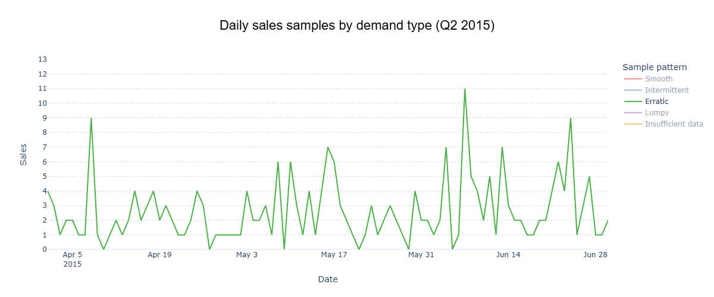

# Clasificación de demanda: La clave silencisa para modelos de forecasting
---
**Autor:** Nicolás Jiménez Díaz


<p align="center"><em>Image generated with AI</em></p>

---

Uno de los grandes retos del retail actual es predecir cuántas unidades de un producto se venderán en cada una de sus tiendas durante un periodo específico. Este desafío es fundamental, ya que de su resolución dependen múltiples procesos clave: la proyección de la demanda, la planificación de presupuestos, la definición de estrategias de precios, la gestión de reposiciones y muchas otras decisiones operativas. Al final del día, la venta es el núcleo que sostiene toda la operación.

*El desafío*
---

Aunque los análisis suelen realizarse a nivel agregado (categorías, sucursales, líneas de producto, entre otros), la realidad es que la transacción ocurre en su nivel más básico: el ítem individual dentro de una sucursal en particular.

En este nivel atómico —la mínima unidad de desagregación— tanto las entradas de inventario (reposiciones) como las salidas (ventas) se fragmentan en microtransacciones. Y es ahí donde surge la verdadera complejidad: un mismo producto puede mostrar un comportamiento completamente distinto según el punto de venta en el que se ofrezca, ya que cada tienda responde a condiciones contextuales únicas.

La clave está en anticiparse a esos comportamientos heterogéneos: reconocerlos, modelarlos y gestionarlos de manera diferenciada es lo que permite alcanzar la eficacia operativa.

*La realidad*
---

Al descender hasta este nivel atómico de la demanda, lo que emerge son series de ventas discontinuas: largos intervalos sin movimiento y, cuando la demanda finalmente aparece, concentraciones mínimas de apenas 1 o 2 unidades.

Analizar datos agregados puede dar la ilusión de simplicidad, pero tarde o temprano es necesario llegar a esta capa granular. Y es en ese punto donde las aparentes regularidades se desvanecen: lo que en lo agregado parecía una tendencia estable se revela, en la base, como un mosaico irregular que a primera vista parece obedecer al azar.

*La evidencia*
---

Esto no es una exageración: la competencia M5 demostró que es precisamente en este nivel donde se concentran los mayores errores de predicción, en especial cuando se trata de series intermitentes y ruidosas (Makridakis, Spiliotis y Assimakopoulos, 2022).


<p align="center"><em>M5 Accuracy competition: Results, findings, and conclusions (Spyros Makridakis, Evangelos Spiliotis, Vassilios Assimakopoulos, International Journal of Forecasting, 2022)
</em></p>

En este artículo nos adentraremos en cómo dar forma a ese aparente caos. A lo largo de las últimas décadas, la investigación en forecasting ha generado indicadores y métricas que permiten clasificar los distintos tipos de demanda. Comprender estas categorías es el primer paso para enfrentar sus desafíos y, sobre todo, para revelar la clave oculta que hace posible construir sistemas de reposición realmente inteligentes.

---

## Resumen

Este análisis no se basa en datos sintéticos, sino en información real. Para ello utilizamos el conjunto de datos de la [M5 Forecasting Competition](https://www.kaggle.com/competitions/m5-forecasting-accuracy/data), enfocándonos en el ***segundo trimestre de 2015 (Q2 2015)***. El periodo abarca ***91 días de registro***, con ***3.049 productos*** distribuidos en ***10 tiendas***.

Siguiendo lo planteado por Croston (1972), examinamos tanto la ocurrencia de la demanda como el volumen cuando esta se presenta. Los hallazgos son contundentes: ***el 73 % de las series exhiben un comportamiento altamente intermitente, con ventas concentradas en apenas 1 o 2 unidades, distribuidas en solo 30 del total de 91 días observados***. Este fenómeno no corresponde a ruido aleatorio, sino a una dinámica estructural del retail, confirmada tanto por la literatura como por la evidencia empírica de la competencia M5.

Antes de aplicar modelos de predicción avanzados, resulta esencial clasificar y comprender la naturaleza de la demanda. Muchos equipos se apresuran a probar algoritmos sofisticados, pero sin esta base conceptual, los errores se multiplican. ***Métricas como el ADI y el CV² ofrecen una forma simple y poderosa de caracterizar los patrones, diferenciando entre demandas esporádicas y estables***. Este enfoque —propuesto inicialmente por Syntetos, Boylan & Croston (2005) y refinado por Kostenko & Hyndman (2006)— constituye el punto de partida para construir sistemas de forecast realmente efectivos.

---

## Clasificación de la demanda: poner orden en el caos

Sin embargo, no es posible predecir lo que aún no se comprende. Antes de aspirar a un modelo perfecto, es fundamental entender en profundidad los patrones de comportamiento de la demanda y aceptar la naturaleza que estos presentan. Solo así será posible adaptarse de forma efectiva y reducir los altos niveles de error, los cuales, para el negocio, se traducen en costos de inventario, liquidaciones forzadas y, lo más crítico, ventas perdidas.


<p align="center"><em>Image generated with AI</em></p>

Comprender estos patrones no es un fin en sí mismo: es la base sobre la cual se construyen los sistemas de asignación de mercadería en el punto de venta. Dichos sistemas constituyen el núcleo operativo de cualquier negocio, ya que su objetivo es claro: **satisfacer la demanda de manera eficiente, evitando tanto los quiebres de stock como la acumulación de inventario**, que a la larga deriva en obsolescencia y pérdidas económicas por liquidaciones.


---

## Data y alcance del análisis

Para aterrizar este tema de forma práctica, utilizaremos datos reales provenientes de la [competencia M5 Forecasting](https://www.kaggle.com/competitions/m5-forecasting-accuracy/data). En particular, trabajaremos con un subconjunto correspondiente al **segundo trimestre de 2015 (Q2 2015)**, que cubre del **1 de abril al 30 de junio**, es decir, un total de **91 días de observación**.

Este subconjunto incluye 3.049 productos distribuidos en 10 sucursales, lo que da un universo potencial de 30.490 combinaciones producto–sucursal. De ellas, cerca de 29 mil presentaron ventas durante el periodo de estudio, constituyendo las observaciones efectivas de demanda analizadas.

### Nivel agregado

En el gráfico agregado se observa un patrón global con ventas diarias en torno a las **37 mil unidades**, con un rango que varía entre **28 y 49 mil unidades**. Los picos de alta venta contrastan fuertemente con los valles, reflejando la volatilidad en el consumo.


### Nivel atómico

Sin embargo, cuando descendemos al nivel más atómico —el ítem individual por sucursal— la realidad cambia drásticamente. Las ventas se concentran casi siempre en **1 o 2 unidades**, predominando los casos de venta única. Además, aparecen múltiples periodos sin ventas, lo que evidencia que la demanda no se manifiesta de forma continua. Cuando surge, su magnitud promedio se mantiene dentro de un rango reducido.


Este contraste es revelador: mientras que en el nivel agregado las ventas parecen seguir un patrón relativamente estable y predecible, al descender al nivel más atómico lo que emerge es un panorama fragmentado y errático. Las series individuales muestran largos periodos sin ventas y, cuando estas ocurren, se concentran casi siempre en 1 o 2 unidades.

En otras palabras, lo que en lo agregado luce como un flujo ordenado se descompone, en la base, en un mosaico de microeventos discontinuos. Este comportamiento es precisamente lo que define la demanda intermitente, caracterizada formalmente por John Croston (1972) en su obra seminal Forecasting and Stock Control for Intermittent Demands.

---
## Metodologia

### a) Resumen de estadisticas de ventas a nivel item-store

***Nota técnica:*** *Para el análisis a gran escala, utilizamos DuckDB, lo que nos permitió consultar eficientemente un conjunto de datos con millones de registros sin necesidad de cargarlo completamente en memoria. Este enfoque permite escalar de manera fluida al procesar datos de años completos que abarcan miles de productos y tiendas.*

```python
import pandas as pd
import duckdb as ddb

con = ddb.connect()

query = """
SELECT
  id, item_id, store_id,
  MIN(CASE WHEN sales > 0 THEN date END) AS first_sale_date,
  MAX(CASE WHEN sales > 0 THEN date END) AS last_sale_date,
  DATE_DIFF('day',
    MIN(CASE WHEN sales > 0 THEN date END),
    MAX(CASE WHEN sales > 0 THEN date END)
  ) AS sales_window_days,
  SUM(CASE WHEN sales > 0 THEN 1 ELSE 0 END) AS selling_days,
  AVG(NULLIF(sales,0)) AS avg_sales,
  STDDEV_POP(NULLIF(sales,0)) AS std_sales
FROM read_parquet('{SALES_DATA_PATH}')
WHERE year = 2015 AND quarter = 2
GROUP BY store_id, item_id, id
HAVING SUM(CASE WHEN sales > 0 THEN 1 ELSE 0 END) > 0
"""

demand_summary = con.query(query).to_df()
```

|   | id                           | item_id    | store_id | first_sale_date | last_sale_date | sales_window_days | selling_days | avg_sales | std_sales |
|---|------------------------------|------------|----------|-----------------|----------------|-------------------|--------------|-----------|-----------|
| 0 | FOODS_1_001_CA_1_validation  | FOODS_1_001 | CA_1    | 2015-04-02      | 2015-06-27     | 86                | 35           | 1.600     | 0.868     |
| 1 | FOODS_1_001_CA_2_validation  | FOODS_1_001 | CA_2    | 2015-04-02      | 2015-06-29     | 88                | 31           | 2.194     | 1.874     |
| 2 | FOODS_1_001_CA_3_validation  | FOODS_1_001 | CA_3    | 2015-04-04      | 2015-06-30     | 87                | 28           | 2.464     | 3.300     |
| 3 | FOODS_1_001_CA_4_validation  | FOODS_1_001 | CA_4    | 2015-04-08      | 2015-06-26     | 79                | 21           | 1.238     | 0.426     |
| 4 | FOODS_1_001_TX_1_validation  | FOODS_1_001 | TX_1    | 2015-04-04      | 2015-06-30     | 87                | 28           | 1.321     | 0.710     |
| 5 | FOODS_1_001_TX_2_validation  | FOODS_1_001 | TX_2    | 2015-04-02      | 2015-06-15     | 74                | 27           | 1.370     | 0.554     |
| 6 | FOODS_1_001_TX_3_validation  | FOODS_1_001 | TX_3    | 2015-04-01      | 2015-06-27     | 87                | 26           | 2.000     | 1.359     |
| 7 | FOODS_1_001_WI_1_validation  | FOODS_1_001 | WI_1    | 2015-04-04      | 2015-06-28     | 85                | 26           | 1.192     | 0.482     |
| 8 | FOODS_1_001_WI_2_validation  | FOODS_1_001 | WI_2    | 2015-04-01      | 2015-06-30     | 90                | 29           | 1.241     | 0.677     |
| 9 | FOODS_1_001_WI_3_validation  | FOODS_1_001 | WI_3    | 2015-04-02      | 2015-06-24     | 83                | 12           | 1.167     | 0.553     |

---
### b) Proceso de clasificacion

#### Metricas para clasificar demanda

#####  1) ADI (Average Demand Interval)

**Fórmula original (literatura):**

\[
ADI = \frac{\text{Number of Periods}}{\text{Number of Periods with Demand}}
\]

**Interpretación:** mide el intervalo promedio (en días) entre ocurrencias de ventas positivas.

  - ***ADI bajo*** → demanda frecuente (más cercana a continua).  
  - **ADI alto** → demanda dispersa (más intermitente).  

**Implementación en código:**

```python
demand_summary["ADI"] = (
    91 / demand_summary["selling_days"]
)
```

---

##### 2) CV² (Coeficiente de variación al cuadrado)

\[
CV^2 = \left(\frac{\sigma}{\mu}\right)^2
\]

***Donde:***

  - $\sigma$ = desviación estándar de las cantidades vendidas (*solo considerando ventas > 0*).  
  - $\mu$ = media de las cantidades vendidas (*solo considerando ventas > 0*).  

**Interpretación:** CV² captura la *volatilidad de las cantidades vendidas* cuando ocurre la demanda.  

- ***CV² bajo*** → unidades de venta estables.  
- ***CV² alto*** → unidades de venta altamente variables.  

**Implementación en código:**

```python
demand_summary["CV2"] = (
    (demand_summary["std_sales"] / demand_summary["avg_sales"]) ** 2
)
```

---

#### Reglas de clasificación (Syntetos & Boylan, 2005)

| Clasificación | Descripción |
|---------------|-------------|
| **Suave (Smooth)** | <div align="center">Frecuente y estable<br>ADI < 1.32 y CV² < 0.49</div> |
| **Intermitente (Intermittent)** | <div align="center">Esporádica pero estable<br>ADI ≥ 1.32 y CV² < 0.49</div> |
| **Errática (Erratic)** | <div align="center">Frecuente pero volátil<br>ADI < 1.32 y CV² ≥ 0.49</div> |
| **Irregular / Lumpy (Lumpy)** | <div align="center">Esporádica y volátil<br>ADI ≥ 1.32 y CV² ≥ 0.49</div> |


**Implementación en código:**

```python
def classify_demand(df,
                    horizon_days=91):
    """
    Classify each item into a demand type following Syntetos & Boylan (2005).

    Categories:
        - Smooth       : ADI < 1.32  and CV² < 0.49
        - Intermittent : ADI ≥ 1.32 and CV² < 0.49
        - Erratic      : ADI < 1.32  and CV² ≥ 0.49
        - Lumpy        : ADI ≥ 1.32 and CV² ≥ 0.49
    """

    # Thresholds defined in the literature
    ADI_THR = 1.32
    CV2_THR = 0.49

    # Compute demand metrics
    df["ADI"] = (horizon_days / df["selling_days"]).round(3)
    df["CV2"] = ((df["std_sales"] / df["avg_sales"]) ** 2).round(3)

    # Classification rules
    conditions = [
        (df["ADI"] < ADI_THR) & (df["CV2"] < CV2_THR),   # Smooth
        (df["ADI"] >= ADI_THR) & (df["CV2"] < CV2_THR),  # Intermittent
        (df["ADI"] < ADI_THR) & (df["CV2"] >= CV2_THR),  # Erratic
        (df["ADI"] >= ADI_THR) & (df["CV2"] >= CV2_THR)  # Lumpy
    ]
    labels = ["Smooth", "Intermittent", "Erratic", "Lumpy"]

    # Assign demand category
    df["demand_type"] = np.select(conditions, labels, default="Unknown")

    return df
```

---
#### Manejo de datos insuficientes

Los ítems con ventanas de ventas **menores al 20 % del total del periodo de estudio (91 días)** se etiquetan como ***"Insufficient data"***, con el fin de evitar clasificaciones poco representativas.

**Implementación en código:**

```python    
def tag_insufficient_data(df,
                          ratio=0.2,
                          horizon_days=91):
    """
    Tag items as 'Insufficient data' when their sales history 
    is too short to provide reliable classification.
    """

    # Threshold: % of the maximum observed sales window
    sales_threshold = horizon_days * ratio
    
    # Relabel demand_type for items below threshold
    df['demand_type'] = np.where(
        df['sales_window_days'] < sales_threshold,
        'Insufficient data',
        df['demand_type']
    )

    return df
```

---
## Hallazgos

### a) Estadisticas generales

**Intermittent demand dominates**: 73% of item-store combinations exhibit intermittent patterns, selling an average of 1.6 units every 4 days during the analyzed period.


The remaining portfolio distributes as follows:
- Smooth: 12%
- Lumpy: 10%
- Erratic: 3%
- Insufficient data: 3%

**Key portfolio metrics**:


### b) Visual Examples

Now let's see how these patterns look graphically. Each demand type has distinct visual characteristics that make pattern recognition intuitive once you know what to look for:

**Intermittent** (ADI=3.70, CV²=0.12): HOBBIES_1_366 at CA_1
- Sales window: 85 days, selling days: 23
- Average sales: 1.22 units, low variation (std=0.41)
- Clear gaps between sales with consistent quantities


**Smooth** (ADI=1.03, CV²=0.22): HOBBIES_1_275 at TX_2  
- Sales window: 90 days, selling days: 87
- Average sales: 2.98 units, moderate variation (std=1.40)
- Nearly continuous sales with stable quantities


**Erratic** (ADI=1.06, CV²=0.56): HOUSEHOLD_1_177 at WI_3
- Sales window: 90 days, selling days: 85  
- Average sales: 2.80 units, high variation (std=2.10)
- Frequent sales but highly variable quantities



**Lumpy** (ADI=2.40, CV²=0.70): FOODS_1_143 at CA_1
- Sales window: 84 days, selling days: 35
- Average sales: 2.09 units, high variation (std=1.75)
- Sporadic sales with unpredictable quantities


**Insufficient data** (ADI=2.00, CV²=0.71): FOODS_1_138 at CA_4
- Sales window: 6 days, selling days: 3
- Metrics unreliable due to limited history


### Key Insights

• **Intermittent patterns require specialized forecasting methods**. Traditional techniques fail when demand occurs sporadically.

• **Sales concentration in 1-2 units** suggests unit-level precision is critical for inventory decisions.

• **High proportion of zero-sales days** confirms the inadequacy of continuous demand assumptions.

• **Pattern stability within categories** validates the classification approach for model selection.

## Implications

Having characterized the portfolio gives us a solid foundation: we know how demand behaves. The next challenge is to anticipate it. But, as with this analysis, before applying any forecasting model—whether statistical, machine learning, or deep learning—it is essential to understand which metrics we will use and their limitations.

Only then can we evaluate whether a model truly responds to business needs, beyond its mathematical precision. Classification helps choose appropriate forecasting models, explains why metrics like MAPE fail for intermittent patterns, and points toward better alternatives like RMSE or MAE that properly handle the realities of sporadic demand.

## Next Steps

This demand classification analysis establishes the groundwork for intelligent forecasting. Future work will explore model selection strategies, performance measurement approaches, and the practical implementation of pattern-based replenishment systems that align mathematical precision with business objectives.

## References

**Croston, J. D.** (1972). Forecasting and stock control for intermittent demands. *Operational Research Quarterly*, 23(3), 289-303.

**Makridakis, S., Spiliotis, E., & Assimakopoulos, V.** (2022). *M5 Accuracy Competition: Results, Findings, and Conclusions*. *International Journal of Forecasting*.

**Syntetos, A. A., Boylan, J. E., & Croston, J. D.** (2005). On the categorization of demand patterns. Journal of the Operational Research Society, 56(5), 495–503.

**Kiefer, D., Grimm, F., Bauer, M., & van Dinther, C.** (2020). Demand Forecasting Intermittent and Lumpy Time Series: Comparing Statistical, Machine Learning and Deep Learning Methods. Proceedings of the 53rd Hawaii International Conference on System Sciences. 

Kolassa, S. (2016). Evaluating predictive count data distributions in retail sales forecasting. *International Journal of Forecasting*, 32(3), 788-803.

Makridakis, S., Spiliotis, E., & Assimakopoulos, V. (2020). The M4 competition: 100,000 time series and 61 forecasting methods. *International Journal of Forecasting*, 36(1), 54-74.

Silver, E. A., Pyke, D. F., & Peterson, R. (1998). *Inventory management and production planning and scheduling* (3rd ed.). John Wiley & Sons.

Syntetos, A. A., & Boylan, J. E. (2005). The accuracy of intermittent demand estimates. *International Journal of Forecasting*, 21(2), 303-314.